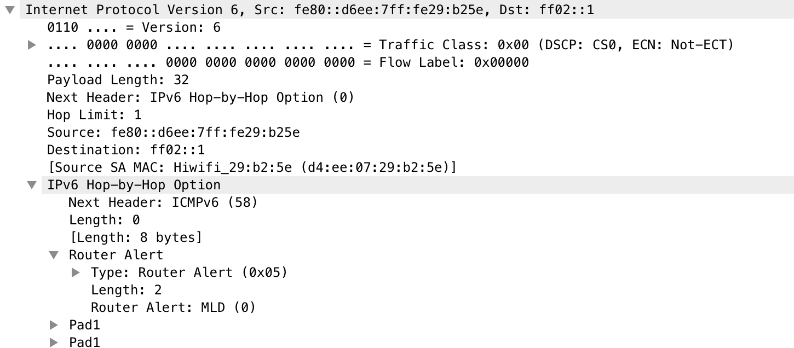
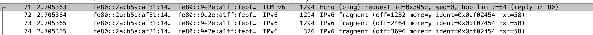
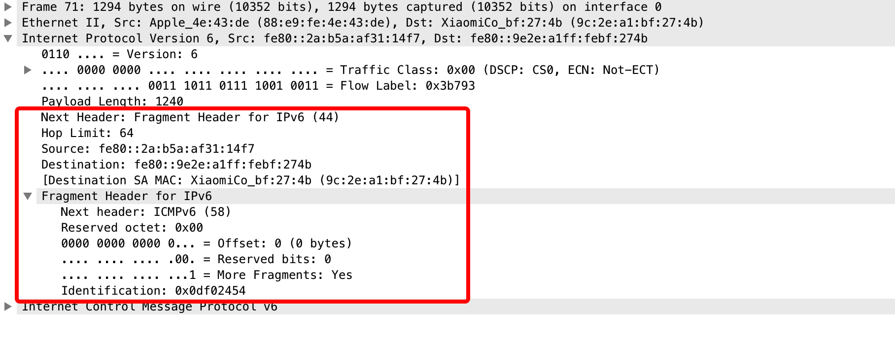
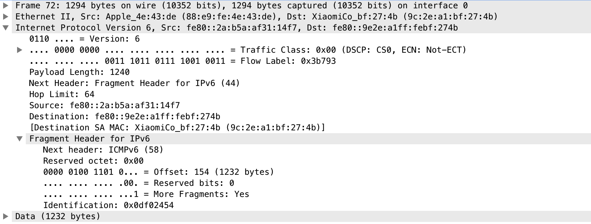
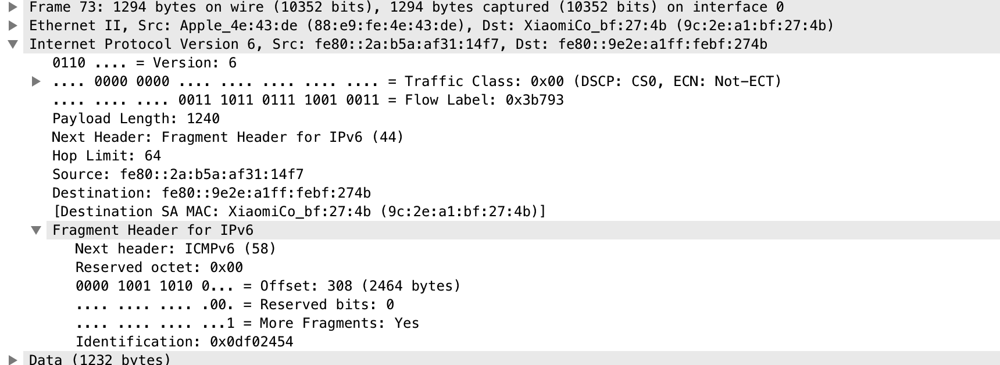
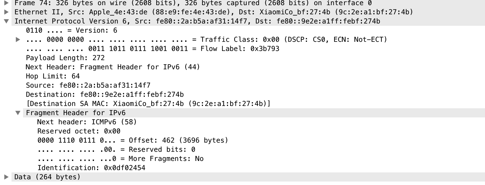

## 第5章 Internet协议
+ IP协议特点
    - 尽力而为交付数据，ip协议不保证数据一定能够成功交付给对端
    - 无连接，每个数据报都是独立，发送方和接收方不会为数据报维护连接信息，这会使得接收方接收数据报的顺序和发送方发送的顺序不一致
+ IPv4头部
    - IPv4头部需要向4字节对齐
    - IPv4头部
    ```
   +-+-+-+-+-+-+-+-+-+-+-+-+-+-+-+-+-+-+-+-+-+-+-+-+-+-+-+-+-+-+-+-+
   |Version|  IHL  |Type of Service|          Total Length         |
   +-+-+-+-+-+-+-+-+-+-+-+-+-+-+-+-+-+-+-+-+-+-+-+-+-+-+-+-+-+-+-+-+
   |         Identification        |Flags|      Fragment Offset    |
   +-+-+-+-+-+-+-+-+-+-+-+-+-+-+-+-+-+-+-+-+-+-+-+-+-+-+-+-+-+-+-+-+
   |  Time to Live |    Protocol   |         Header Checksum       |
   +-+-+-+-+-+-+-+-+-+-+-+-+-+-+-+-+-+-+-+-+-+-+-+-+-+-+-+-+-+-+-+-+
   |                       Source Address                          |
   +-+-+-+-+-+-+-+-+-+-+-+-+-+-+-+-+-+-+-+-+-+-+-+-+-+-+-+-+-+-+-+-+
   |                    Destination Address                        |
   +-+-+-+-+-+-+-+-+-+-+-+-+-+-+-+-+-+-+-+-+-+-+-+-+-+-+-+-+-+-+-+-+
   |                    Options                    |    Padding    |
   +-+-+-+-+-+-+-+-+-+-+-+-+-+-+-+-+-+-+-+-+-+-+-+-+-+-+-+-+-+-+-+-+

   1. Version: 版本，Ipv4固定为4（4 bit)
   2. IHL: 头部长度，当没有选项是为5（5*32 bit=20字节），最大值为15，因此头部最多为60字节（4bit)
   3. TS: 路由器可以针对不同类型来优化数据报路由（8 bit）
   4. Total Length: 总长度，包含头部长度（16 bit）
   5. Identification: 分片标识符，当上层数据经过ip协议分片后，对于来自同一上层协议数据的分片有着相同的标识符（16 bit）
   6. Flags: 待补充（3 bit）
   7. Fragment Offset: 分片偏移，以8字节为单位（13 bit）
   8. Time to Live: TTL，路由跳数限制（8 bit）
   9. Protocol: 上层协议（8 bit）
   10. Header Checksum: 头部校验和，仅验证头部的正确性（16 bit）
   11. Source Address: 发送方ipv4地址
   12. Destination Address: 接收方ipv4地址
   13. Options: 选项，一般没有
   14. Padding: 当选项不足4字节时，用0填充
    ```

+ IPv6头部
    ```
   +-+-+-+-+-+-+-+-+-+-+-+-+-+-+-+-+-+-+-+-+-+-+-+-+-+-+-+-+-+-+-+-+
   |Version| Traffic Class |           Flow Label                  |
   +-+-+-+-+-+-+-+-+-+-+-+-+-+-+-+-+-+-+-+-+-+-+-+-+-+-+-+-+-+-+-+-+
   |         Payload Length        |  Next Header  |   Hop Limit   |
   +-+-+-+-+-+-+-+-+-+-+-+-+-+-+-+-+-+-+-+-+-+-+-+-+-+-+-+-+-+-+-+-+
   |                                                               |
   +                                                               +
   |                                                               |
   +                         Source Address                        +
   |                                                               |
   +                                                               +
   |                                                               |
   +-+-+-+-+-+-+-+-+-+-+-+-+-+-+-+-+-+-+-+-+-+-+-+-+-+-+-+-+-+-+-+-+
   |                                                               |
   +                                                               +
   |                                                               |
   +                      Destination Address                      +
   |                                                               |
   +                                                               +
   |                                                               |
   +-+-+-+-+-+-+-+-+-+-+-+-+-+-+-+-+-+-+-+-+-+-+-+-+-+-+-+-+-+-+-+-+

    1. Version: 同IPv4（4 bit）
    2. Traffic Class: 同IPv4的TS字段（6 bit）
    3. Flow Label: 待补充（20 bit）
    4. PayLoad Length: 负载长度，不包含头部（16 bit）
    5. Next Header: 下一头部（8 bit）
    6. Hop Limit: 同Ipv4 TTL（8 bit）
    7. Source Address: 发送方IPv6地址
    8. Destination Address: 接收方IPv6地址
    ```
+ IPv6扩展头部
    - IPv6选项
        1. IPv6选项填充在逐条选项或者目的地选项中，这两个都作为头部类型存在。
        ```
         +-+-+-+-+-+-+-+-+-+-+-+-+-+-+-+-+-+-+-+-+-+-+-+-+-+-+-+-+-+-+-+-+
         |  Next Header  |  Hdr Ext Len  |                               |
         +-+-+-+-+-+-+-+-+-+-+-+-+-+-+-+-+                               +
         |                                                               |
         .                                                               .
         .                            Options                            .
         .                                                               .
         |                                                               |
         +-+-+-+-+-+-+-+-+-+-+-+-+-+-+-+-+-+-+-+-+-+-+-+-+-+-+-+-+-+-+-+-+
         1). Next Header: 下一头部
         2). Hdr Ext Len: 长度，不包含Next Header和Hdr Ext Len
         3). 选项，选项总是以TLV格式存在，最先1字节是类型，紧接着1字节是长度（不包含首2字节），后面是数据
        ```
        
        ipv6数据报下一头部是逐条选项，逐条选项包含一个TLV，并且填充两个PAD1来向8字节对齐
    - 路由头部
        1. 路由头部提供了发送方定义路由路径
        2. 路由头部包含RH0和RH1，RH0已废弃，因为RH0可以通告多个需要路由的ip才到目的地，会导致恶意用户将多个ip为同一ip，增加DoS攻击效果，导致目的主机无法正常服务
        3. RH2只能包含一个需要路由的地址
    - 分片头部
        
        
        
        
        
    - 移动IP
        1. 移动IP是当节点从一个网络移动到另外一个网络，随之而来的IP地址的改变，但是底层链路层链接仍然可用，移动IP就是为了解决当节点移动到另外一个网络中时，链路层之上的连接仍然有效
        2. 节点将IP数据报转发给支持移动IP的路由器，支持移动的IP的路由器将数据报转发给对应的节点

+ IP转发
    - 转发条目
        1. 转发条目包含目的地，掩码，下一跳，接口
        2. ip数据报目的地地址和掩码做与得到的地址和目的地匹配表示匹配到了一个转发条目
        3. 下一跳是同一链路（广播域）中的一个实体ip地址，用于ARP(IPv4)或者ICMPv6(IPv6)来获取MAC地址
        4. 接口用于当发送方选择填充到IP数据报的源地址或者路由器转发链路层帧的网络接口
    - 直接交付
        1. 当节点匹配到的转发条目下一跳地址和接口地址一致表示不需要经过路由器转发，节点可以直接将ip数据报封装成帧交付给目的主机
    - 间接交付
        1. 当下一跳地址和接口地址不匹配就需要经过路由器，接口将数据报发送下一跳地址对应的节点，直至逐条转发到目的主机

+ 主机模式
    - 强主机模式
        1. 接口接收或者发送的数据，只有源IP或者目的IP和接口IP严格匹配才会进行下一步操作（将数据传递给高层协议或者发送数据报）
    - 弱主机模式
        1. 接口接收或者发送的数据，源IP或者目的IP和主机某个接口的IP匹配就可以进行下一步操作·
+ 参考链接
    - [理解IPv6头部](https://www.microsoftpressstore.com/articles/article.aspx?p=2225063&seqNum=4)
    - [rfc791](https://tools.ietf.org/html/rfc791)
    - [rfc2460](https://tools.ietf.org/html/rfc2460)

+ TODO
    - 第10章学习完后补充IPv4分片细节