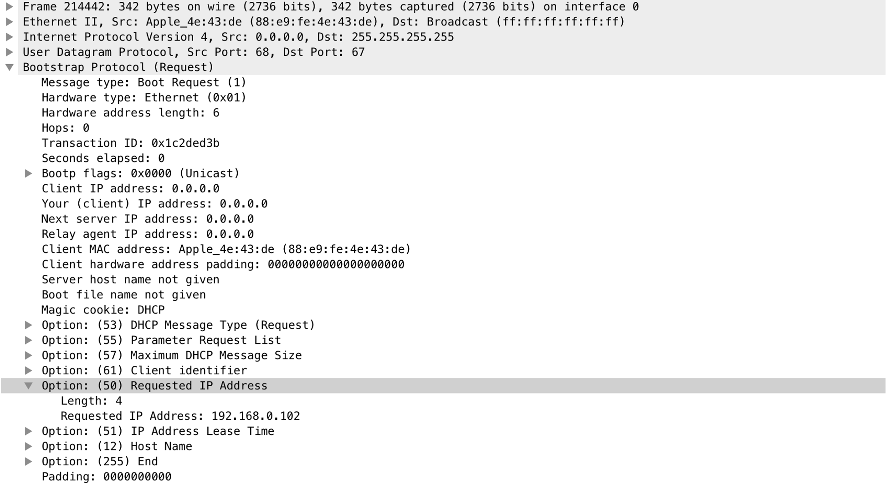
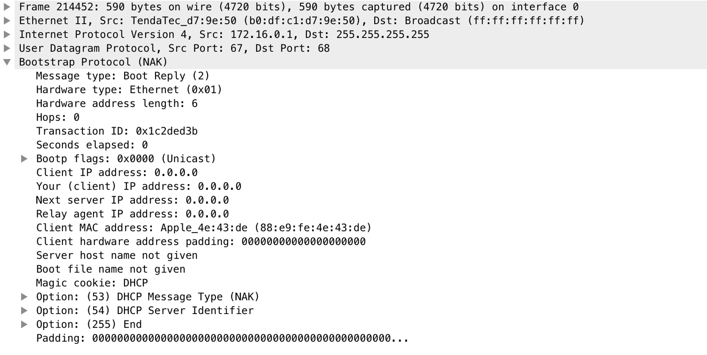
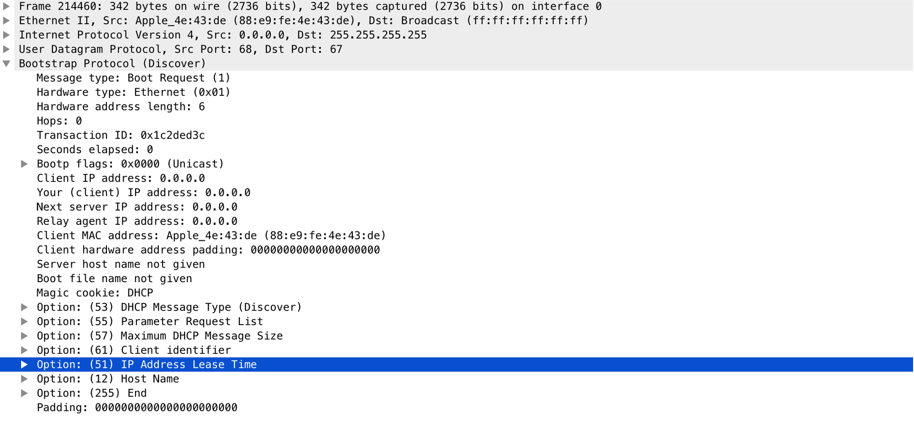
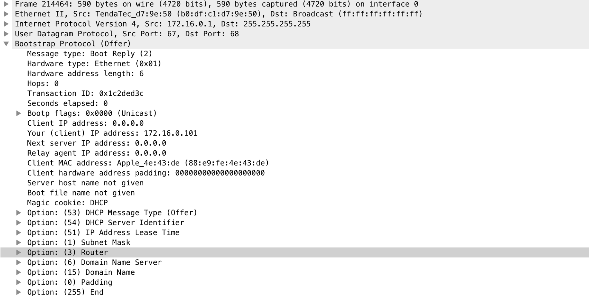
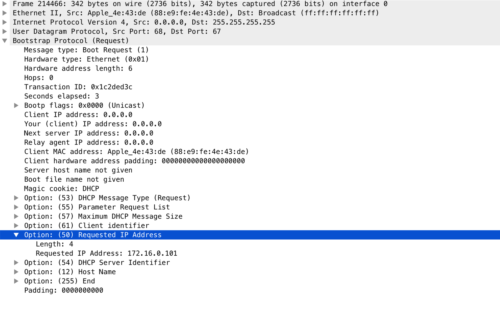
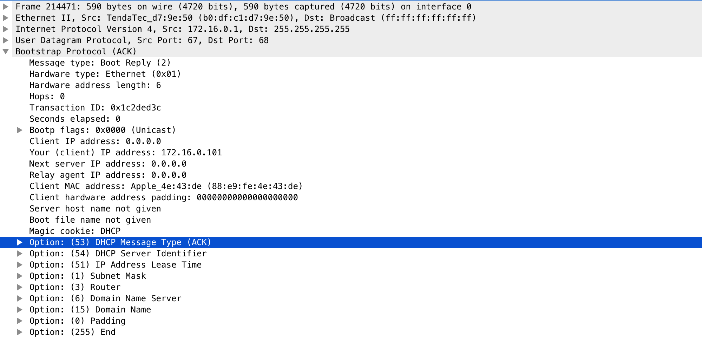

## 第6章 系统配置：DHCP和自动配置
### DHCP协议
+ DHCP协议用于为客户机自动分配IPv4地址以及能够使用TCP/IP协议的基本信息
+ DHCP协议是客户机——服务器协议，其运行在UDP协议之上
    - 客户机加入本地链路中，会在本地链路广播消息类型是`DHCPDISCOVERY`的DHCP消息
    - 如果本地链路存在DHCP服务器一个或多个，它们会在本地链路广播消息类型是`DHCPOFFER`的DHCP消息，客户机通过客户机硬件地址来确定哪台客户机需要处理该`DHCPOFFER`消息
        1. 特殊case：如果本地链路没有DHCP服务器，那么客户机为了在本地链路进行通信会自动分配一个本地链路地址
    - 当收到多个`DHCPOFFER`消息，客户机会选择一台在本地联络员广播消息类型是`DHCPREQUEST`的消息，并且在选项中携带服务器标识符选项已确定客户机选择的是哪台DHCP服务器
    - DHCP服务器收到`DHCPREQUEST`消息后，会根据服务器标识符选项确定是否需要处理该消息，如果匹配，会在本地链路广播消息类型是`DHCPACK`的消息，在消息头部会携带分配的IPv4地址和多个必要的选项，如子网掩码，DNS服务域名和IP等
    - 客户机在收到`DHCPACK`消息后，并且检查分配的IPv4在本地链路是否存在冲突，这个可以通过[ARP协议的地址冲突检测](第4章-地址解析协议.md)来完成，如果没有发生冲突，客户机将会使用该地址直到超过租用期或者达到续约期
        1. 特殊case：如果检测冲突，客户机会发送`DHCPDECLINE`消息类型的DHCP消息给服务器，以通知该地址不可用，在经过10s延迟后会再次进行重试
    - 当客户机仅仅希望更新租约，可以避免发送`DHCPDISCOVER`，直接发送`DHCPREQUEST`，避免过多数据需要发送
+ 通过修改路由器地址范围，触发主机发送DHCP消息
    
    
    
    
    
    
### DHCPv6协议
+ DHCPv6用于为主机分配IPv6地址和使用TCP/IP协议必要的信息
+ DHCPv6基于UDP/IPv6之上，是客户机——服务器类型协议
    - IPv6客户机加入到本地链路后会根据本地链路地址前缀(fe80)自动分配一个本地链路地址，一般会根据链路层地址来形成本地链路地址
    - 客户机在本地链路组播所有节点ICMPv6的邻居请求消息进行重复地址检测（DAD），如果没有冲突，会在本地链路组播所有路由器ICMPv6路由请求消息以决定下一步该如何处理
    - 当客户机接收到的ICMPv6路由通告消息中`M`或者`O`位被设置，表示需要通告DHCPv6来获取信息，`M`位表示需要通告DHCPv6来获取IPv6地址，`O`位表示需要通告DHCPv6获取地址之外的信息
    - 客户机决定使用DHCPv6来获取IPv6地址或者其他信息后，会组播DHCPv6服务发现`SOLICT`消息
    - DHCPv6服务器会发送`ADVERTISE`消息，包含分配给客户机的IPv6地址和其他信息，客户机从收到的一个或多个选择一台作为目标DHCPv6服务器，通过服务器标识符来确定选择的是那一台DHCPv6服务器，并且发送`REQUEST`消息
    - DHCPv6服务器接收到`REQUEST`消息以请求绑定IPv6地址，DHCPv6服务器将会以`REPLY`消息确认
+ 当本地链路不存在DHCPv6服务器或者路由器通告请求中`M`和`O`位被置0，那么客户机将采用无状态的地址分配
    - 客户机根据路由器通告中的地址前缀选项来决定如何分配地址
    - 客户机对自己分配的地址进行DAD

### 参考链接
- [本地链路广播的MAC地址](https://www.ietf.org/proceedings/65/slides/16ng-3/sld5.htm)

### TODO
- ICMPv6