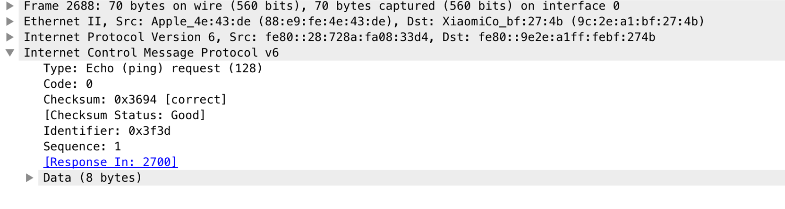
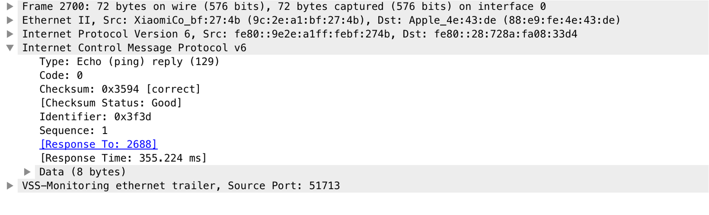
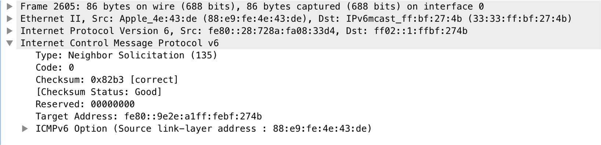
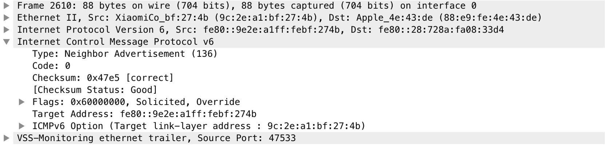

## 第8章 ICMPv4和ICMPv6: Internet控制报文协议
### ICMP协议
+ ICMP协议用于为终端系统提供能够感知到某些错误的IP数据报能力
+ ICMP报文分为差错报文和查询报文
    - 差错报文一般是对失败的IP数据报发送方发送，用于提示发送方出现的错误
        1. 目的不可达，接收方不愿意处理接收到的数据报
        2. 主机不可达，IP数据报直接交付的主机不存在
        3. 端口不可达，接收主机没有进程愿意处理分组
        4. 数据报过大，发送方设置禁止分片位，但是数据报超过链路层限制大小
        5. 重定向，当IP数据报下一跳发现本身不是合理的下一跳时，将会发送
        6. 超时，IP数据报头部TTL（跳数限制）为0，导致不能进行转发
    - 查询报文一般是请求/应答形式存在
        1. 回显/应答（ICMPv4和ICMPv6）
        
        
        2. 路由器发现和路由器通告（ICMPv4和TCMPv6，但是ICMPv6使用更广泛），主机能够确定本地链路中可用路由器，从而确定默认路由，也能够确定地址配置是选择有状态的地址配置还是SLAAC（无状态的地址配置），有状态地址配置就是采用DHCPv6来分配地址，无状态地址分配就是主机根据路由器通告的前缀选项和某个值（一般是网络接口地址）来形成一个IPv6地址
        3. 邻居发现（邻居请求和邻居通告），邻居请求和邻居通告类似IPv4的ARP协议，能够实现IP地址和链路层地址的映射
        
        
        