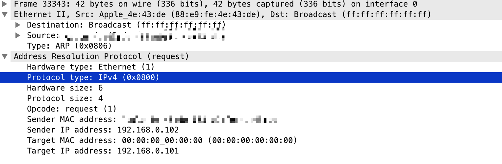
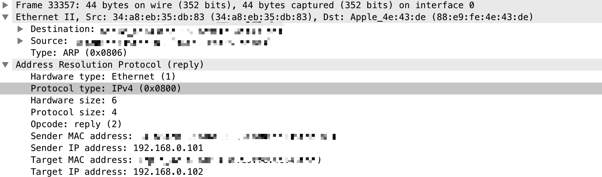
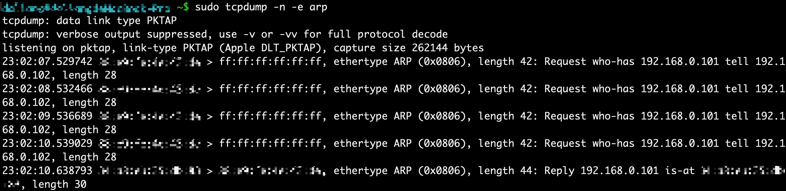

## 第4章 地址解析协议
+ 地址解析协议（ARP）
    - 网络层使用IP地址将数据报从一种类型的网络转发到另外一个类型的网络，当IP前缀和当前网络的前缀相同时，对于以太网来说，网关会按照MAC地址将数据报转发到对应的主机，这个过程叫做直接交付，不需要经过软件层面的转发，也就是路由器转发
    - 当网关的ARP缓存条目中没有对应IPv4地址的MAC地址时，会向网络中广播一个ARP查询请求，ARP查询请求携带目的IPv4地址，当网络中的目的主机收到该ARP查询请求时，会发送ARP响应给网关，网关再将网络层数据报封装成帧，并且帧头部添加目的主机MAC地址
    - ARP抓包
        1. WireShark
        
        
        2. tcpdump
        
+ arp命令
    - arp命令可以显示和删除主机的ARP缓存
    - `arp -a`显示ARP缓存
    - `arp -d <hostname>`删除hostname的ARP缓存条目

+ 免费ARP
    - 免费ARP是将发送发IP地址和接收方IP地址都配置为主机自身某个网络接口的IP地址
    - 免费ARP用于通知LAN(VLAN)中的其他主机，发送主机的MAC地址发送改变，这样可以更新同一网络中其他主机的ARP缓存
    - 免费ARP也用于检查同一网络中是否已经配置了相同IP的主机。当配置了相同的IP地址的主机收到免费ARP，就会发送ARP响应给发送方，这样发送方就知道网络已经有配置了相同IP的主机

+ IPv4地址冲突检测（ACD）
    - 可以通过免费ARP检测到IP地址冲突，但是免费ARP不能解决冲突
    - 当网络中存在一台以上配有相同IP的主机时，他们会不停发送免费ARP请求，这就回导致其他主机的ARP缓存震荡
    - ACD用于解决上述两个问题。ACD有两种ARP请求类型，分别是ARP探测和ARP通告，ARP探测用于检查是否发送IPv4地址冲突，ARP通告是用于告诉同一网络中的其他主机，该IPv4地址被发送主机占用。ARP探测为了避免ARP缓存震荡问题，发送方IP地址设为0，ARP通告就是正常的免费ARP请求
    - 当网络接口第一次使用时，为了避免网络内大量ARP探测导致网络流量激增，在随机等一个时间后，开始发送3个ARP探测，当没有收到ARP响应，表明IP地址可用，就发送ARP通告；反之，表示有其他主机使用了同一IP地址，rfc规定发生冲突时发送方需要采取的动作：
        1. 停止使用该地址
        2. 保留这个地址，发送ARP通告，如果冲突继续，停止使用
        3. 继续使用，不理会冲突

+ 参考链接
    - [Ipv4地址冲突检测](https://zhiliao.h3c.com/Theme/details/27896)